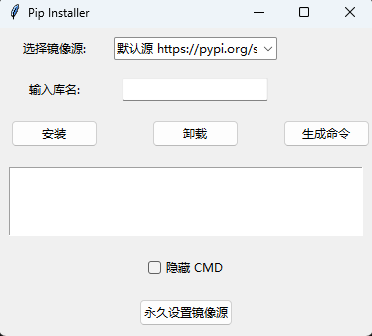

## Pip Installer

Pip Installer 这是由初一学生liaoruiheng开发的程序，旨在简化小白安装Python库的过程。该程序是一个使用 Python 和 Tkinter 制作的图形用户界面工具，用于简化 Python 包的安装和卸载过程。用户可以选择镜像源并输入库名称，以便快速进行 pip 操作。

## 功能

- 选择不同的镜像源进行包安装。
- 安装和卸载指定的 Python 包。
- 生成安装命令并展示在文本框中。
- 永久设置镜像源。
- 选择隐藏或显示命令行窗口。
- 在后台或新窗口中执行安装和卸载操作。

## 技术栈

- Python 3.x
- Tkinter
- subprocess

## 安装要求

确保您的计算机上已安装以下软件：

- Python 3.x
- pip

本程序由B站up主WIN11-23H2开发，欢迎关注！